# 📓 Claude Code Working Diary

**Claude Code 작업 내용, 자동으로 기록됩니다.**

[](https://github.com/solzip/claude-code-hooks-diary/actions/workflows/ci.yml)
[](https://opensource.org/licenses/MIT)
[](https://www.python.org/downloads/)
[](https://github.com/solzip/claude-code-hooks-diary)

> **[English](README.en.md)** | 한국어

> ⚠️ This is a community project, not officially affiliated with Anthropic.

Claude Code 세션마다 수많은 작업이 이뤄집니다 — 기능 구현, 파일 수정, 버그 수정. 하지만 세션이 끝나면 그 맥락은 사라집니다. **claude-diary**가 이 모든 것을 자동으로 기록합니다.

```bash
pip install claude-diary && claude-diary init  # 이게 끝입니다.
```

<p align="center">
  
</p>

## 어떻게 동작하나요?

```
Claude Code 세션 종료
        │
        ▼
  Stop Hook 자동 실행
        │
        ▼
  트랜스크립트 분석 → 작업 내용, 파일, 명령어, Git 정보 추출
        │
        ▼
  ~/working-diary/2026-03-24.md  ← 일지 자동 생성
```

설정 없이 바로 동작합니다. 세션이 끝날 때마다 Hook이 자동 실행되어 구조화된 마크다운 일지를 생성합니다.

## 지원 환경

| 플랫폼 | Python | 자동 일지 | 주간 요약 | Cron |
|--------|--------|-----------|-----------|------|
| macOS | python3 | ✅ | ✅ | ✅ |
| Linux | python3 | ✅ | ✅ | ✅ |
| Windows (Git Bash) | python | ✅ | ✅ | ❌ (Task Scheduler 사용) |

## 기록되는 내용

| 항목 | 설명 |
|------|------|
| 📋 작업 요청 | 사용자가 Claude에게 요청한 내용 |
| 📄 생성된 파일 | 새로 만들어진 파일 목록 |
| ✏️ 수정된 파일 | 편집된 파일 목록 |
| ⚡ 주요 명령어 | 실행된 중요 shell 명령어 |
| 📝 작업 요약 | AI가 수행한 작업의 요약 |
| ⚠️ 이슈 | 발생한 오류나 문제 |

## 설치

### 방법 1: pip (권장)

```bash
pip install claude-diary
claude-diary init
```

### 방법 2: Claude Code 플러그인

```bash
# Claude Code 안에서
/plugin marketplace add https://github.com/solzip/claude-code-hooks-diary
/plugin install working-diary
```

### 방법 3: 수동 설치

```bash
git clone https://github.com/solzip/claude-code-hooks-diary.git
cd claude-code-hooks-diary/working-diary-system
./install.sh
```

설치 후 자동으로:
- Stop Hook 등록 (세션 종료마다 자동 실행)
- `~/working-diary/` 디렉토리 생성
- 설정 파일 생성

## 디렉토리 구조

```
~/working-diary/
├── 2026-03-15.md          ← 일일 작업일지
├── 2026-03-16.md
├── 2026-03-17.md
├── .session_counts.json    ← 내부 카운트 (자동)
├── .gitignore
└── weekly/
    ├── W11_2026-03-09.md   ← 주간 요약 리포트
    └── W12_2026-03-16.md
```

## 일지 예시

```markdown
# 📓 작업일지 — 2026-03-17 (화요일)

> 이 파일은 Claude Code Stop Hook에 의해 자동 생성됩니다.
> 각 세션이 종료될 때마다 작업 내용이 자동으로 기록됩니다.

---

### ⏰ 09:32:15 | 📁 `ai-chatbot`

**📋 작업 요청:**
  1. WebSocket 핸들러에 circuit breaker 패턴 구현해줘
  2. 에러 코드 정의서 업데이트

**📄 생성된 파일:**
  - `.../handler/CircuitBreakerHandler.java`

**✏️ 수정된 파일:**
  - `.../config/WebSocketConfig.java`
  - `.../constant/ErrorCode.java`

**⚡ 주요 명령어:**
  - `./gradlew test`
  - `./gradlew bootRun`

**📝 작업 요약:**
  - Circuit breaker 패턴이 WebSocket 핸들러에 구현 완료
  - 3단계 상태 전환(CLOSED→OPEN→HALF_OPEN) 로직 추가
```

## 환경변수 설정

| 환경변수 | 설명 | 기본값 |
|----------|------|--------|
| `CLAUDE_DIARY_LANG` | 일지 언어 (`ko` 또는 `en`) | `ko` |
| `CLAUDE_DIARY_DIR` | 일지 저장 경로 | `~/working-diary` |
| `CLAUDE_DIARY_TZ_OFFSET` | UTC 오프셋 | `9` (KST) |

```bash
# ~/.bashrc 또는 ~/.zshrc에 추가
export CLAUDE_DIARY_LANG="ko"
export CLAUDE_DIARY_DIR="$HOME/working-diary"
export CLAUDE_DIARY_TZ_OFFSET="9"
```

**Windows 환경변수 설정:**
```powershell
# PowerShell (영구 설정)
[Environment]::SetEnvironmentVariable("CLAUDE_DIARY_LANG", "ko", "User")
[Environment]::SetEnvironmentVariable("CLAUDE_DIARY_DIR", "$env:USERPROFILE\working-diary", "User")
```

## CLI 명령어

```bash
claude-diary search "키워드"              # 키워드 검색
claude-diary filter --project my-app      # 프로젝트 필터
claude-diary trace src/main.py            # 파일 변경 이력
claude-diary stats                        # 터미널 대시보드
claude-diary weekly                       # 주간 요약 생성
claude-diary dashboard                    # HTML 대시보드
claude-diary audit                        # 보안 감사 로그
claude-diary audit --verify               # 소스 코드 무결성 검증
claude-diary config                       # 설정 확인
claude-diary team stats                   # 팀 통계
claude-diary team weekly                  # 팀 주간 리포트
```

## 주요 기능

| 기능 | 설명 |
|------|------|
| 자동 카테고리 | feature/bugfix/refactor/docs/test/config/style 자동 분류 |
| Git 연동 | 브랜치, 커밋, 변경량 (+/- lines) 자동 기록 |
| 시크릿 스캔 | 패스워드, API 키, 토큰 자동 마스킹 (11+ 패턴) |
| 검색 인덱스 | 수개월 일지에서도 빠른 검색 |
| 5개 Exporter | Notion, Slack, Discord, Obsidian, GitHub 연동 |
| HTML 대시보드 | GitHub 잔디 히트맵, 오프라인 차트 (CDN 없음) |
| 보안 감사 | audit 로그, SHA-256 checksum 변조 감지 |
| 팀 모드 | 접근 제어, Git 중앙 repo, 팀 리포트 |

## 요구사항

- Python 3.8+ (`python3` or `python`)
- Claude Code (hooks 지원 버전)
- 외부 의존성 없음 (코어), API 토큰 불필요

## 팁

**CLAUDE.md에 추가하면 더 좋은 일지가 생성됩니다:**

```markdown
## 작업일지
- 세션 종료 시 작업 내용이 자동 기록됩니다
- 작업 완료/구현/수정 시 명확한 요약을 출력해주세요
```

## 로드맵

| Phase | 목표 | 버전 | 상태 |
|-------|------|------|------|
| **A** | 개인 생산성 도구 (카테고리, Git, CLI, 플러그인, 대시보드) | v2.0.0 | ✅ 완료 |
| **B** | 오픈소스 커뮤니티 (보안, 테스트 40개, CI/CD) | v3.0.0 | ✅ 완료 |
| **C** | 팀/회사 도구 (접근 제어, Git 중앙 repo, 팀 리포트) | v4.0.0 | ✅ 완료 |
| **D** | 배포 (플러그인, PyPI, 마켓플레이스) | v4.1.0 | ✅ 완료 |

자세한 내용은 [`docs/plans/`](docs/plans/) 디렉토리를 참고하세요.

## 라이선스

MIT License — [LICENSE](LICENSE)
